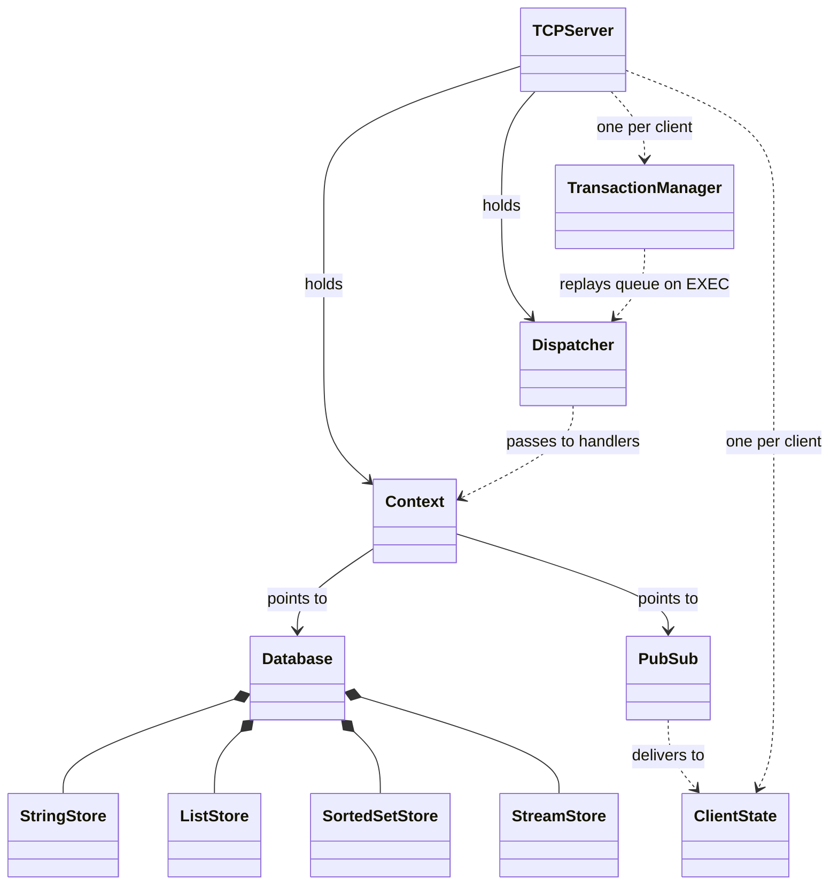

# CacheMeIfYouCan

A from-scratch, Redis-compatible in-memory data store written in modern C++.


CacheMeIfYouCan speaks the [RESP](https://redis.io/docs/reference/protocol-spec/)
wire protocol, so any Redis client — `redis-cli`, a language binding, or plain
`nc` — can talk to it. It is a learning project, not a production cache: the goal
is a clean, readable implementation of the ideas behind Redis (protocol framing,
a keyspace of typed stores, blocking commands, and transactions) rather than raw
throughput.

> **Status:** string/key, list, sorted-set, stream, geospatial, and pub/sub
> commands working over TCP, plus `MULTI`/`EXEC` transactions with optimistic
> `WATCH` locking and optional password authentication. Multi-threaded server,
> one thread per client.

---

## Architecture at a glance



A per-client `TCPServer` thread runs the transaction manager and dispatcher; the
`Database` facade owns one typed store per data type, and the shared `PubSub`
registry fans messages out to each subscriber's `ClientState`. Full class
members and the dynamic flows (blocking `BLPOP`, `WATCH`/`EXEC`, `PUBLISH`
fan-out) are in [docs/uml.md](docs/uml.md).

---

## Features

- **RESP protocol** — full parser and encoder for simple strings, errors,
  integers, bulk strings, arrays, and null values, with correct handling of
  partial reads and pipelined commands.
- **Strings & keys** — `SET` (with `PX` expiry), `GET`, `DEL`, `INCR`, `KEYS`,
  `TYPE`, `CONFIG GET`.
- **Lists** — `RPUSH`, `LPUSH`, `LRANGE`, `LLEN`, `LPOP`, and blocking `BLPOP`.
- **Sorted sets** — `ZADD`, `ZRANK`, `ZRANGE`, `ZCARD`, `ZSCORE`, `ZREM`.
- **Streams** — `XADD` (auto, partial `ms-*`, and explicit IDs), `XRANGE`, and
  `XREAD` with `COUNT`, `BLOCK`, and the `$` cursor.
- **Geospatial** — `GEOADD`, `GEOPOS`, `GEODIST`, `GEOSEARCH`, sorted-set backed
  with a Redis-compatible 52-bit geohash (`TYPE` reports `zset`).
- **Pub/Sub** — `SUBSCRIBE`, `UNSUBSCRIBE`, `PUBLISH`, and `PUBSUB`
  (`CHANNELS`/`NUMSUB`), delivering messages across connections from a shared
  channel registry.
- **Transactions** — `MULTI`, `EXEC`, `DISCARD`, plus `WATCH`/`UNWATCH`
  optimistic locking that aborts the transaction if a watched key changed.
- **Authentication** — optional `--requirepass`; unauthenticated connections are
  rejected with `NOAUTH` until they send `AUTH`, plus `ACL WHOAMI`.
- **Concurrency** — one thread per connection; each typed store guards its own
  data with a `std::mutex`, and blocking commands wait on a `condition_variable`.

No third-party libraries — just the C++20 standard library and POSIX sockets.

---

## Documentation

| Doc                                                  | What's in it                                                                                 |
| ---------------------------------------------------- | -------------------------------------------------------------------------------------------- |
| [docs/architecture.md](docs/architecture.md)         | Request flow, threading model, RESP framing, the keyspace facade, and the full command table |
| [docs/design-decisions.md](docs/design-decisions.md) | The choices worth explaining — and the tradeoffs each one accepts                            |
| [docs/uml.md](docs/uml.md)                           | Class and sequence diagrams (Mermaid, rendered inline on GitHub)                             |

---

## Building

```bash
mkdir build && cd build
cmake ..
make -j$(nproc)
```

For an optimized build:

```bash
cmake .. -DCMAKE_BUILD_TYPE=Release
make -j$(nproc)
```

## Running

The server listens on port `6379` by default:

```bash
./redis_server
./redis_server --port 6380 --dir /tmp/redis-data --dbfilename dump.rdb
```

A quick smoke test without any client installed:

```bash
printf '*1\r\n$4\r\nPING\r\n' | nc -q 1 127.0.0.1 6379
# +PONG
```

## Usage

With `redis-cli` pointed at the server:

```text
$ redis-cli -p 6379

> SET greeting "hello"
OK
> GET greeting
"hello"
> RPUSH tasks a b c
(integer) 3
> LRANGE tasks 0 -1
1) "a"
2) "b"
3) "c"

> ZADD board 100 alice 80 bob
(integer) 2
> ZRANGE board 0 -1
1) "bob"
2) "alice"

> XADD events * kind login user 42
"1710000000000-0"
> XREAD COUNT 10 STREAMS events 0
...

# in one client:
> SUBSCRIBE news
1) "subscribe"
2) "news"
3) (integer) 1
# in another client:
> PUBLISH news "hello"
(integer) 1
# the first client then receives:
1) "message"
2) "news"
3) "hello"

> WATCH balance
OK
> MULTI
OK
> INCR balance
QUEUED
> EXEC          # aborts with (nil) if balance changed since WATCH
1) (integer) 1
```

---

## Project layout

```text
include/          public headers (.hpp)
  protocol/       RESPMessage, RESPParser + encoders
  storage/        Database facade + StringStore, ListStore, SortedSetStore, StreamStore
  pubsub/         PubSub channel registry
  command/        Dispatcher, Context, per-family command registration
  server/         TCPServer, per-connection handler + ClientState, TransactionManager
src/              implementations, mirroring include/
docs/             architecture, design decisions, UML
```

Four static libraries — `protocol`, `storage`, `command`, `server` — are wired
together in `src/main.cpp`. Dependencies flow downward only: `server` → `command`
→ `protocol` + `storage`.

---

## Roadmap

### Done

- [x] TCP server, one thread per client
- [x] RESP protocol parser / encoder
- [x] Case-insensitive command dispatch
- [x] Strings & keys: `SET` (+`PX`), `GET`, `DEL`, `INCR`, `KEYS`, `TYPE`, `CONFIG GET`
- [x] Lists: `RPUSH`, `LPUSH`, `LRANGE`, `LLEN`, `LPOP`, `BLPOP`
- [x] Sorted sets: `ZADD`, `ZRANK`, `ZRANGE`, `ZCARD`, `ZSCORE`, `ZREM`
- [x] Streams: `XADD`, `XRANGE`, `XREAD` (with `COUNT` and `BLOCK`)
- [x] Transactions: `MULTI`, `EXEC`, `DISCARD`, `WATCH`, `UNWATCH`
- [x] Geo: `GEOADD`, `GEOPOS`, `GEODIST`, `GEOSEARCH`
- [x] Pub/Sub: `SUBSCRIBE`, `UNSUBSCRIBE`, `PUBLISH`, `PUBSUB`
- [x] Auth: `--requirepass`, `AUTH`, `ACL WHOAMI`, `NOAUTH` gate

### Planned

- [ ] Persistence: RDB snapshot loading, AOF
- [ ] Replication: `REPLICAOF`, `PSYNC`
- [ ] Beyond: multi-database (`SELECT`), eviction policies, cluster sharding

---

## Testing

There is no automated test suite yet. Behaviour is verified manually with
`redis-cli` and `nc` against a running server — see the smoke test above and the
examples in [docs/architecture.md](docs/architecture.md).

---

## Author

[Shubh Garg](https://github.com/shubh-garg18)
