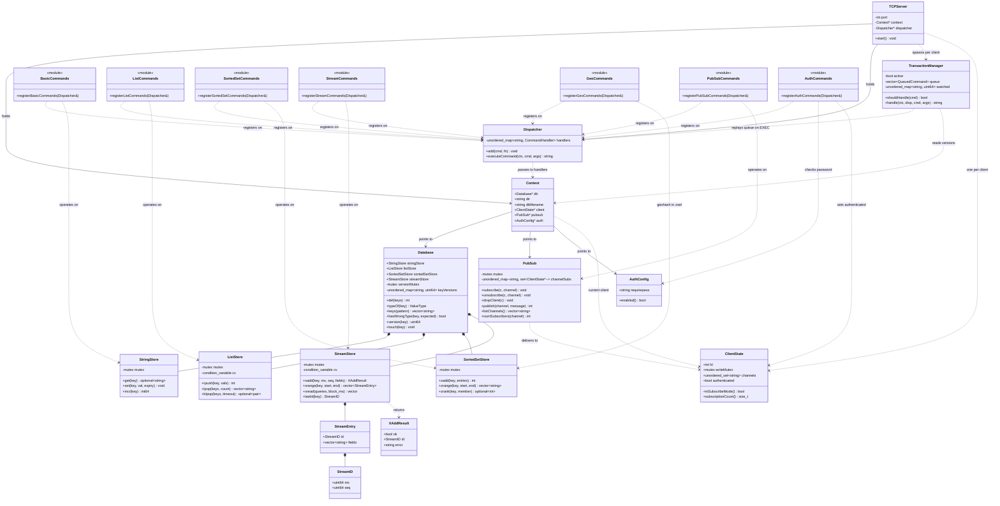
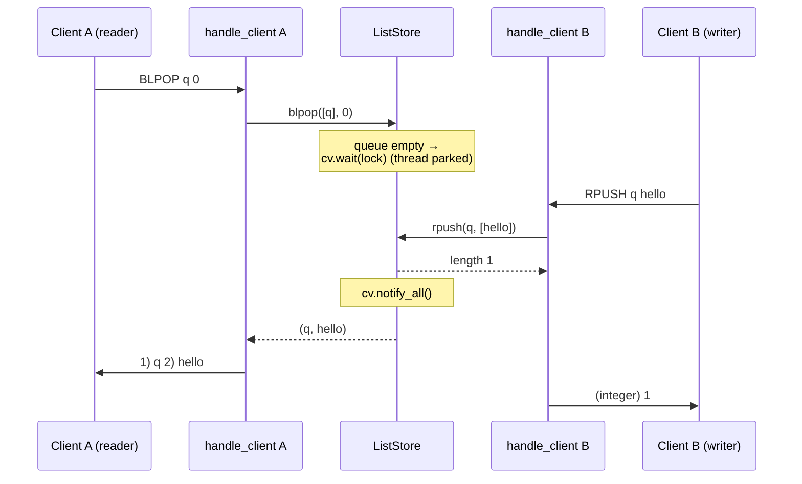
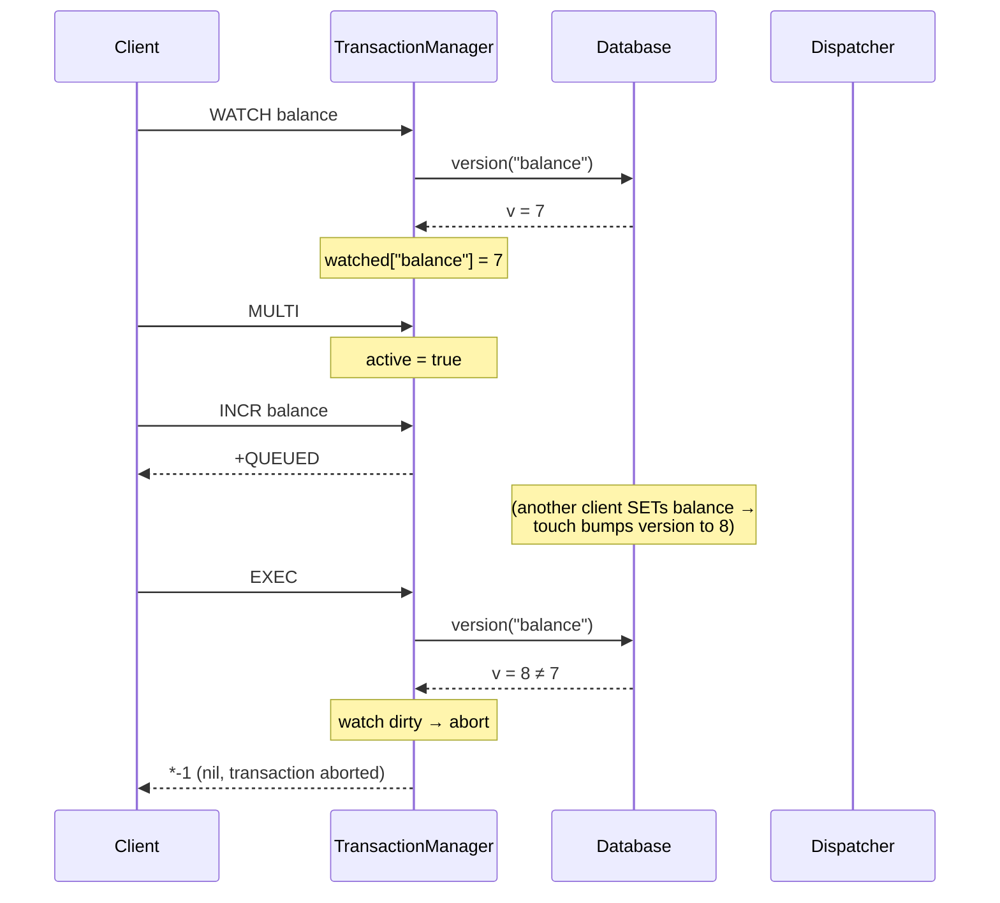
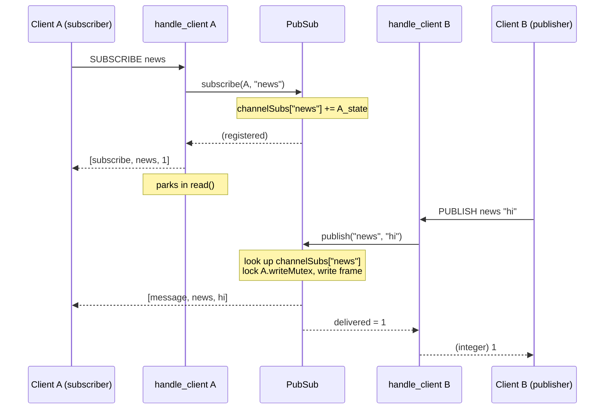

# UML Diagrams

Diagrams are written in [Mermaid](https://mermaid.js.org/), which GitHub renders
inline — no image files to keep in sync. These cover what the ASCII diagrams in
[architecture.md](architecture.md) can't show well: the class structure and
three dynamic flows. The request flow, module layout, and RESP framing live in
architecture.md and are not repeated here.

---

## 1. Class diagram

The core types and how they relate. `♦──` is composition (owns), `..>` is
uses/depends. Command modules (`<<module>>`) are groups of free handler
functions — each registers on the `Dispatcher` and operates on one store; note
`GeoCommands` has no store of its own, storing its geohash in the sorted set,
`PubSubCommands` operates on the shared `PubSub` registry (reaching other
connections' `ClientState`) rather than on `Database`, and `AuthCommands` reads
the shared `AuthConfig` and flips its own connection's `authenticated` flag.

---

## 2. Sequence: blocking `BLPOP` unblocked by another client

Two clients, one condition variable. The reader parks its thread; the writer
wakes it.

---

## 3. Sequence: a transaction with `WATCH`

`WATCH` snapshots a version; `EXEC` compares it. If the watched key changed, the
whole transaction is discarded.

---

## 4. Sequence: `PUBLISH` fan-out across connections

The publisher's thread writes into the subscriber's socket. The registry maps a
channel to the subscribers listening on it; delivery locks each subscriber's
`writeMutex` so it can't collide with that client's own replies.

