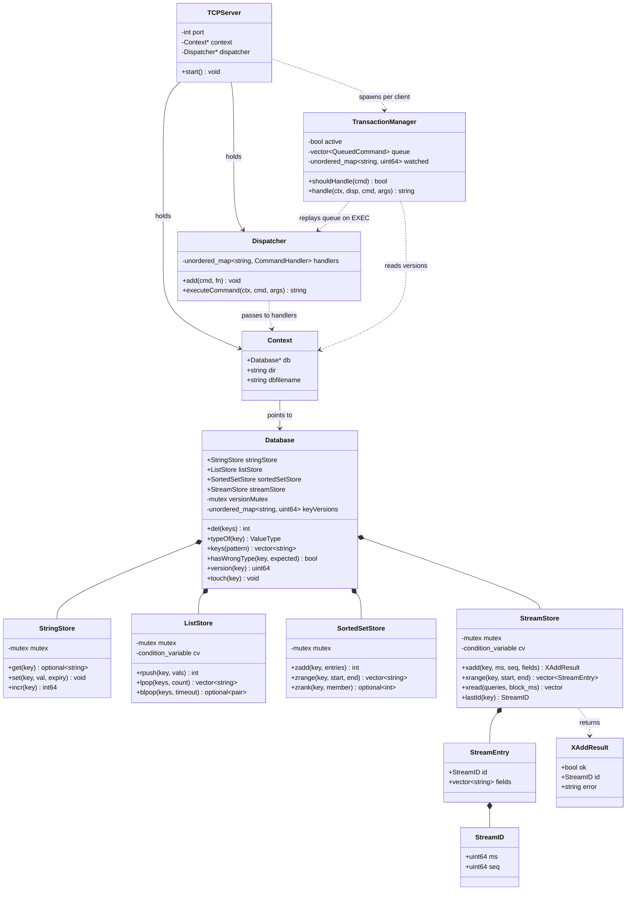
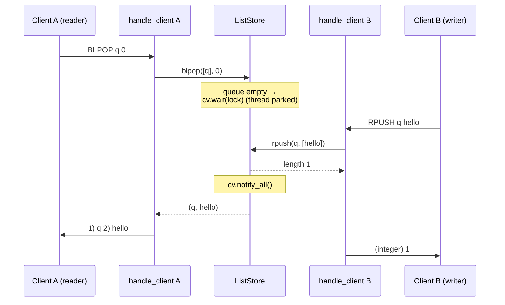
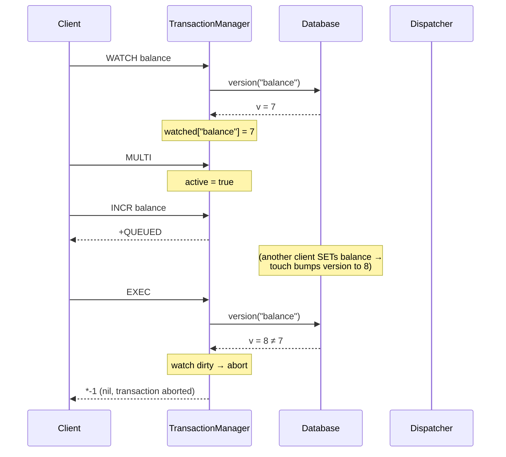

# UML Diagrams

Diagrams are written in [Mermaid](https://mermaid.js.org/), which GitHub renders
inline — no image files to keep in sync. These cover what the ASCII diagrams in
[architecture.md](architecture.md) can't show well: the class structure and two
dynamic flows. The request flow, module layout, and RESP framing live in
architecture.md and are not repeated here.

---

## 1. Class diagram

The core types and how they relate. `♦──` is composition (owns), `──▷` is
inheritance/uses.

---

## 2. Sequence: blocking `BLPOP` unblocked by another client

Two clients, one condition variable. The reader parks its thread; the writer
wakes it.

---

## 3. Sequence: a transaction with `WATCH`

`WATCH` snapshots a version; `EXEC` compares it. If the watched key changed, the
whole transaction is discarded.

